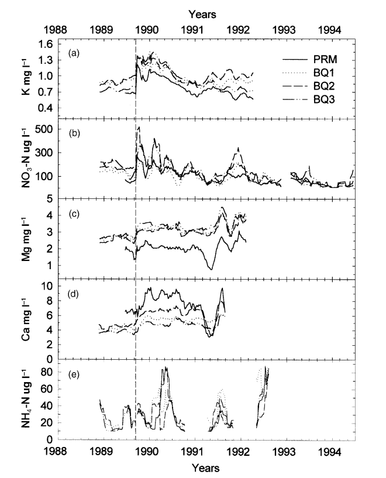

## Background
Schaefer et al. (2000) investigated the concentrations of five different nutrients at four different watersheds in the years before the 1989 Hurricane Hugo and in the years that followed. The five different nutrients are (a) Potassium (K), (b) Nitrate-N (NO3-N), (c) Magnesium (Mg), (d) Calcium (Ca), (e) Ammonium-N (NH4-N). The four different watersheds are Puente Roto Mameyes (RMP), Bisley Quebradas 1, 2 and 3 (BQ1, BQ2 and BQ3).

<center>

</center>

## Data
The data sets are downloaded from: McDowell, William H., and USDA Forest Service. International Institute Of Tropical Forestry (IITF). 2024. “Chemistry of Stream Water from the Luquillo Mountains.” Environmental Data Initiative. https://doi.org/10.6073/PASTA/F31349BEBDC304F758718F4798D25458.

## Methods 
The goal of this analysis was to recreate Figure 3 from Schaefer et al. (2000) (shown above). To do so, I read in a data set from each watershed and applied an original function, moving_average(), which calculates the average concentrations for each nutrient at each watershed every 9 weeks from 1988 to 1994. 

## Results
Below is my recreation of Figure 3 from Schaefer et al. (2000), the concentrations of potassium, nitrate-N, magnesium, calcium, and ammonium-N, in Bisley, Puerto Rico streams before and after Hurricane Hugo. The vertical line marks the time of the hurricane disturbance in 1989. 
```{r}
#| warning: false
#| echo: false
#| fig-width: 8.5
#| fig-height: 8
library(tidyverse)

clean_movingaverage <- read_csv("../output/movingaverage.csv")

movingaverage_newnames <- clean_movingaverage |>
  mutate(
    nutrient = fct_recode(
      nutrient,
      "K~mg~l^-1" = "k_mgl",
      "Mg~mg~l^-1" = "mg_mgl",
      "NO[3]-N~mu*g~l^-1" = "no3_mgl",
      "Ca~mg~l^-1" = "ca_mgl",
      "NH[4]-N~mu*g~l^-1" = "nh4_mgl"
    )
  )

ggplot(
  data = movingaverage_newnames,
  mapping = aes(
    x = window_start,
    y = concentration,
    color = site,
    linetype = site
  )
) +
  geom_line() +
  facet_wrap(
    ~nutrient,
    scales = "free",
    ncol = 1,
    labeller = label_parsed,
    strip.position = "left"
  ) +
  theme_classic() +
  labs(
    x = "Years",
    y = "Concentration",
    linetype = " ",
    color = " ",
    title = "Hurricane Hugo effects on stream chemistry in Bisley, Puerto Rico"
  ) +
  geom_vline(xintercept = ymd("1989-09-18"), linetype = "dashed") +
  theme(
    strip.placement = "outside",
    strip.background = element_blank()
  )
```